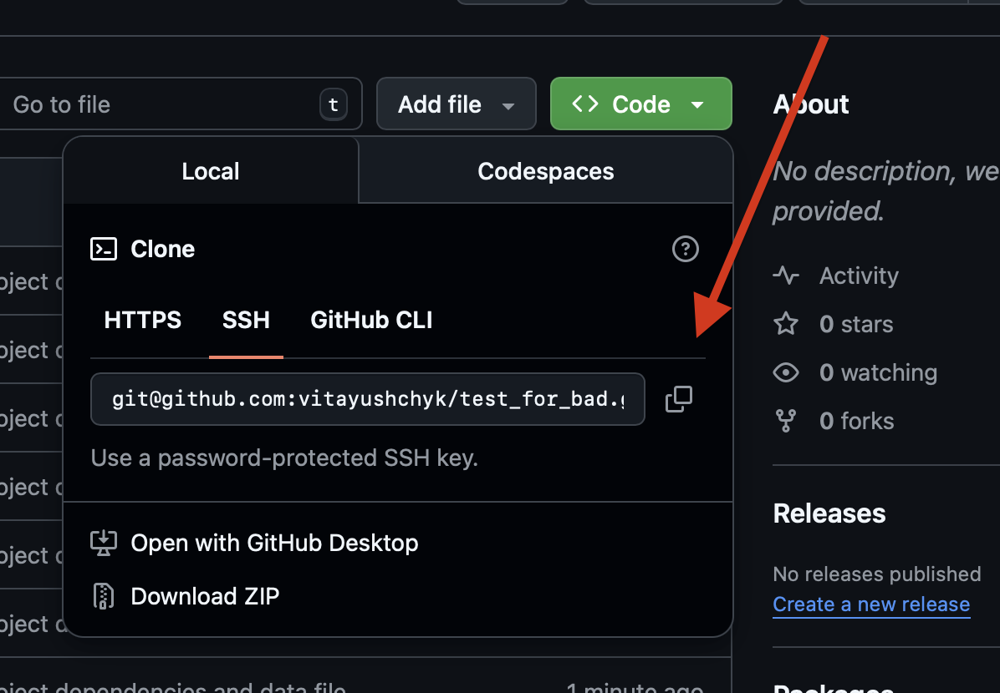

# **Become A Developer: Longest Number Puzzl**

## Overview

This repository contains a solution for
the longest puzzle task, part of the Become A Developer internship application process.
The puzzle consists of fragments of numbers, where fragments can be connected if the last two digits
of one fragment match the first two digits of another. The goal is to build the longest possible chain using
each fragment only once.

### Clone this repository using GitHub Desktop:

## Run app:

- Run application:

      python3 main.py

## Contributors:

- [Vita Yushchyk](https://www.linkedin.com/in/vita-yushchyk-484680205/)